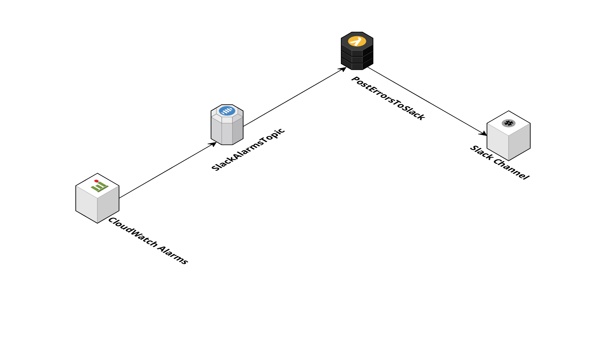

![Banner][icon-banner]

[![MIT Licensed][icon-license]][link-license]
[![NPM Version][icon-npm]][link-npm]
[![Build Status][icon-ci-travis]][link-ci-travis]
[![Build Status][icon-ci-codebuild]][link-ci-codebuild]
[![Greenkeeper Status][icon-greenkeeper]][link-greenkeeper]

[![Code Issues][icon-issues]][link-issues]
[![Codebase Maintainability][icon-maintainability]][link-maintainability]
[![Test Coverage][icon-coverage]][link-coverage]
[![Jest][icon-jest]][link-jest]

[![Serverless][icon-serverless]][link-serverless]
[![Commitizen][icon-commitizen]][link-commitizen]
[![Semantic Release][icon-semantic-release]][link-semantic-release]
[![Prettier][icon-prettier]][link-prettier]



## Installation

### With CI

```bash
export SLACK_HOOK_URL=<slack-hook-url>
scripts/deploy-codebuild.sh
```

### Without CI

```bash
serverless create --template-url https://github.com/EndemolShineGroup/serverless-slack-notifier --path my-project
cd my-project
yarn
export SLACK_HOOK_URL=<slack-hook-url>
serverless deploy
```

[icon-banner]: docs/assets/banner.png

[icon-license]: https://img.shields.io/github/license/EndemolShineGroup/serverless-slack-notifier.svg?longCache=true&style=flat-square
[link-license]: LICENSE
[icon-npm]: https://img.shields.io/npm/v/@endemolshinegroup/serverless-slack-notifier.svg?longCache=true&style=flat-square
[link-npm]: https://www.npmjs.com/package/@endemolshinegroup/serverless-slack-notifier
[icon-ci-travis]: https://img.shields.io/travis/com/EndemolShineGroup/serverless-slack-notifier.svg?longCache=true&style=flat-square
[link-ci-travis]: https://travis-ci.com/EndemolShineGroup/serverless-slack-notifier
[icon-ci-codebuild]: https://codebuild.us-east-1.amazonaws.com/badges?uuid=eyJlbmNyeXB0ZWREYXRhIjoibWpPQStoRzNVU3NZeHM0dEtWLzJxUFZOeERuM29xRlVLVUZMNU9NN3k0VTdjSWJNVjB6dEs5bmsyVCtFcm1XUEdmclQ0aitZUWMyNTFLNVVmbHRoM1d3PSIsIml2UGFyYW1ldGVyU3BlYyI6InBVOVlBdFhQU3kxTXcvZkoiLCJtYXRlcmlhbFNldFNlcmlhbCI6MX0%3D&branch=develop
[link-ci-codebuild]: https://console.aws.amazon.com/codesuite/codebuild/projects/serverless-slack-notifier/history?region=us-east-1
[icon-greenkeeper]: https://img.shields.io/badge/greenkeeper-enabled-brightgreen.svg?longCache=true&style=flat-square
[link-greenkeeper]: https://greenkeeper.io/

[icon-issues]: https://img.shields.io/codeclimate/issues/EndemolShineGroup/serverless-slack-notifier.svg?longCache=true&style=flat-square
[link-issues]: https://codeclimate.com/github/EndemolShineGroup/serverless-slack-notifier/issues
[icon-maintainability]: https://img.shields.io/codeclimate/maintainability/EndemolShineGroup/serverless-slack-notifier.svg?longCache=true&style=flat-square
[link-maintainability]: https://codeclimate.com/github/EndemolShineGroup/serverless-slack-notifier
[icon-coverage]: https://img.shields.io/codecov/c/github/EndemolShineGroup/serverless-slack-notifier/develop.svg?longCache=true&style=flat-square
[link-coverage]: https://codecov.io/gh/EndemolShineGroup/serverless-slack-notifier

[icon-jest]: https://img.shields.io/badge/tested_with-jest-99424f.svg?longCache=true&style=flat-square
[link-jest]: https://jestjs.io/

[icon-serverless]: https://img.shields.io/badge/serverless-%E2%9A%A1%EF%B8%8F-555.svg?longCache=true&style=flat-square
[link-serverless]: http://www.serverless.com

[icon-commitizen]: https://img.shields.io/badge/commitizen-friendly-brightgreen.svg?longCache=true&style=flat-square
[link-commitizen]: http://commitizen.github.io/cz-cli/
[icon-semantic-release]: https://img.shields.io/badge/%20%20%F0%9F%93%A6%F0%9F%9A%80-semantic--release-e10079.svg?longCache=true&style=flat-square
[link-semantic-release]: https://semantic-release.gitbooks.io/semantic-release/
[icon-prettier]: https://img.shields.io/badge/code_style-prettier-ff69b4.svg?longCache=true&style=flat-square
[link-prettier]: https://prettier.io/

